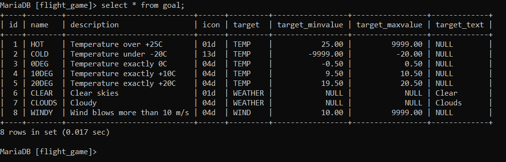

#week3
###Exercise2

#Question1
select * from goal;

#Question2
select name, type from airport where iso_country = "FI";

#Question3
select name from airport where iso_country ="FI" order by name asc;

#Question4
select name, type from airport where iso_country = "FI" order by type asc, name asc;

#Question5
select name from country where name like "F%";

#Question6
select name from country where name like "%F%";

#Question7
select location from game where screen_name = "Vesa";

#Question8
select CO2_consumed from game where screen_name = "Ilkka";

#Question9
select distinct co2_budget from game;

#Question10
select screen_name, co2_budget, co2_consumed, co2_budget-co2_consumed as co2_left from game where screen_name= "Ilkka";

###Exercise3

#Question1
SELECT country.name AS "country name", airport.name AS "airport name"  
FROM country JOIN airport ON country.iso_country = airport.iso_country  
WHERE country.name = 'Iceland';

#Question2
SELECT airport.name AS "airport name"  
FROM airport INNER JOIN country  
ON airport.iso_country = country.iso_country  
WHERE country.name = 'France' AND airport.type = 'large_airport';

#Question3
SELECT country.name AS "country_name", airport.name AS "airport_name" 
FROM airport INNER JOIN country  
ON airport.iso_country = country.iso_country  
WHERE country.continent = 'an';

#Question4
select airport.elevation_ft from game, 
airport where airport.ident = game.location 
and game.screen_name = "heini";

#Question5
select airport.elevation_ft * 0.3048 as elevation_m from game,
airport where airport.ident = game.location  
and game.screen_name = "heini";

#Question6
select airport.name from game,
airport where airport.ident = game.location 
and game.screen_name = "Ilkka";

#Question7
SELECT country.name FROM game 
JOIN airport ON airport.ident = game.location 
INNER JOIN country ON country.iso_country = airport.iso_country 
WHERE game.screen_name = "Ilkka";

#Question8
select goal.name from goal
INNER JOIN goal_reached ON goal.id = goal_reached.goal_id 
INNER JOIN game on goal_reached.game_id = game.id
WHERE game.screen_name = "heini";

#Question9
select airport.name FROM airport 
INNER JOIN game ON airport.ident = game.location   
INNER JOIN goal_reached ON game.id = goal_reached.game_id 
INNER JOIN goal ON goal_reached.goal_id = goal.id 
WHERE goal.name = 'clouds' AND game.screen_name = 'Ilkka'; 

#Question10
SELECT country.name FROM airport  
INNER JOIN game ON airport.ident = game.location  
INNER JOIN goal_reached ON game.id = goal_reached.game_id  
INNER JOIN goal ON goal_reached.goal_id = goal.id  
INNER JOIN country ON airport.iso_country = country.iso_country  
WHERE goal.name = 'clouds' AND game.screen_name = 'Ilkka';
