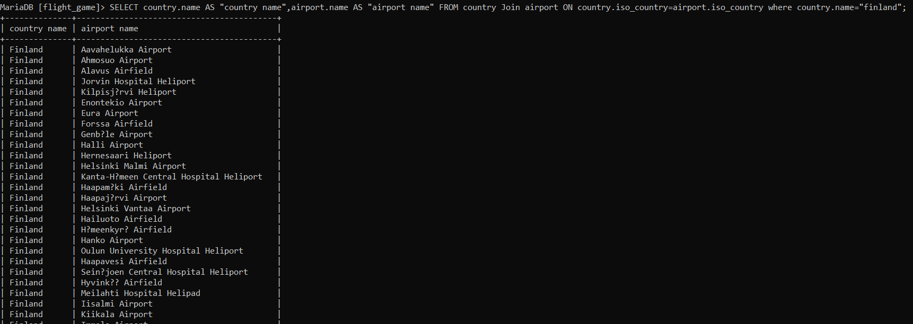
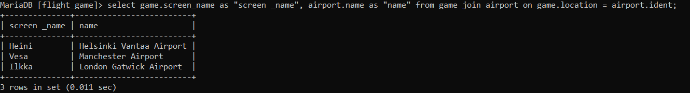
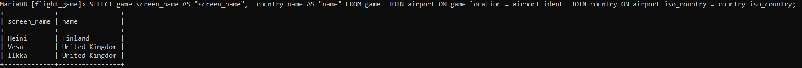
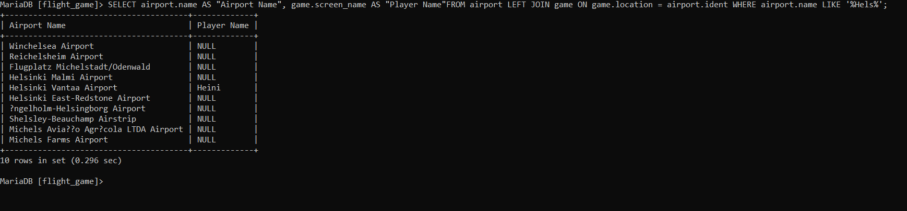
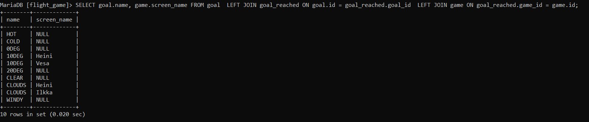

Week4
###Exercise4

#Question1
SELECT country.name AS "country name",
airport.name AS "airport name" 
FROM country Join airport ON country.iso_country=airport.iso_country 
where country.name="finland";

#Question2
select game.screen_name as "screen _name", 
airport.name as "name" from game 
join airport on game.location = airport.ident;

#Exercise3
SELECT game.screen_name AS "screen_name",  country.name AS "name" FROM game  
JOIN airport ON game.location = airport.ident  
JOIN country ON airport.iso_country = country.iso_country;

#Question4
SELECT airport.name AS "Airport Name", game.screen_name AS "Player Name"
FROM airport LEFT JOIN game ON game.location = airport.ident 
WHERE airport.name LIKE '%Hels%';

#Question5
SELECT goal.name, game.screen_name FROM goal  
LEFT JOIN goal_reached ON goal.id = goal_reached.goal_id  
LEFT JOIN game ON goal_reached.game_id = game.id;
