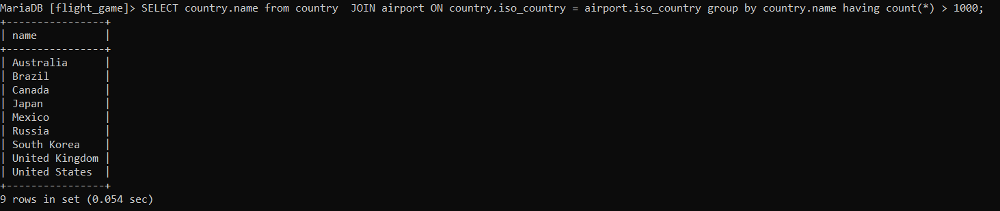

Week5
###Exercise6

#Question1
SELECT max(elevation_ft) from airport;

#Question2
SELECT continent, count(*) from country group by continent;

#Question3
SELECT game.screen_name, count(*)  
FROM game JOIN goal_reached ON game.id = game_id  
GROUP BY game.screen_name;

#Question4
select screen_name from game where co2_consumed in(select min(co2_consumed) from game );

#Question5
SELECT country.name, COUNT(*) FROM country  
JOIN airport ON country.iso_country = airport.iso_country  
GROUP BY name ORDER BY count(*) DESC LIMIT 50;

#Question6
SELECT country.name from country   
JOIN airport ON country.iso_country = airport.iso_country  
group by country.name having count(*) > 1000;

#Question7
SELECT name 
FROM airport 
WHERE elevation_ft = (SELECT MAX(elevation_ft) FROM airport);

#Question8
SELECT country.name 
FROM country 
WHERE iso_country = (SELECT iso_country 
FROM airport WHERE elevation_ft = (SELECT MAX(elevation_ft) FROM airport));

#Question9
SELECT count(*)FROM goal  
JOIN goal_reached ON goal.id = goal_reached.goal_id   
JOIN game ON goal_reached.game_id = game.id  
WHERE screen_name = "Vesa"group by screen_name;

#Question10
SELECT name FROM airport   
WHERE latitude_deg = (SELECT MIN(latitude_deg) FROM airport);

###Exercise7

#Question1
update game set location = (select ident from airport where name = 
"Nottingham Airport"), co2_consumed = co2_consumed+500 
where screen_name = "Vesa"; 
select * from game;

#Question2
goal_reached

#Question3
delete from goal_reached;

#Question4
delete from game;

